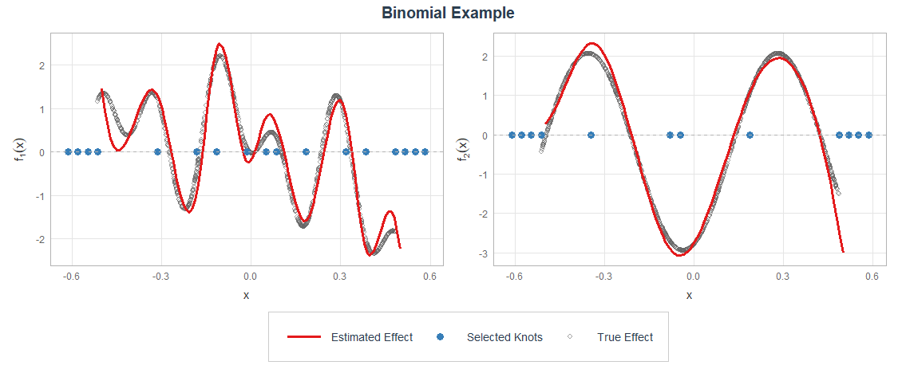

# AKSSAM: Automatic Knot Selection in Smooth Additive Models
Repository associated with the paper:
> Carrizosa, N., Durban, M., Guerrero, V. (2025) `Automatic Knot Selection in Smooth Additive Models`. Manuscript to submit for publication.

This repository contains the implementation in `R` of AKSSAM, which is an algorithm designed to perform automatic knot selection in generalized additive models (GAMs).
Additionally, the scripts and data required to reproduce the computational experiments presented in the article are included.

<div align="center">

</div>

The structure of the repository is the following:
```
/AKSSAM
├── /Computational Experiments 
│   ├── /Required_Scripts              # Folder containing the neccesary functions and datasets
│   │
│   ├── Realdata1ageincome.qmd         # Script for the age–income real data scenario
│   ├── real_data1.RData               # Results from executing Realdata1ageincome.qmd
│   ├── Realdata2ElectricLoad.qmd      # Script for the electric load real data scenario
│   ├── real_data2.RData               # Results from executing Realdata2ElectricLoad.qmd
│   ├── Simulation1SpaHet.qmd          # Script for the SpaHet univariate simulation scenario
│   ├── simulation1.RData              # Results from executing Simulation1SpaHet.qmd
│   ├── Simulation2Gaussian.qmd        # Script for the Gaussian multivariate simulation scenario
│   ├── simulation2.RData              # Results from executing Simulation2Gaussian.qmd
│   ├── Simulation3Poisson.qmd         # Script for the Poisson multivariate simulation scenario
│   └── simulation3.RData              # Results from executing Simulation3Poisson.qmd
│
├── AKSSAM.R                           # R implementation of the AKSSAM method
│
├── EXAMPLE.qmd                        # Illustrative examples of AKSSAM
|
├── /Images                            # Miscellaneous folder
│
├── LICENSE.R                          # License information
│
└── README.md                          # Project documentation
```

## Contact

This project was developed by *Nicolás Carrizosa* (https://github.com/n-carrizo) as part of a research project within the Universidad Carlos III de Madrid.

It benefited from the support of the grant PRTR-CNS2023, funded by MICIU/AEI /10.13039/501100011033 and by European Union NextGenerationEU/PRTR and is part of the project *Modelos Aditivos con Restricciones para la Optimización Global*.

## Disclaimer

This is a preliminary version of the algorithm. It is unstable and may exhibit issues.

## License

This repository is licensed under the [MIT License](LICENSE).